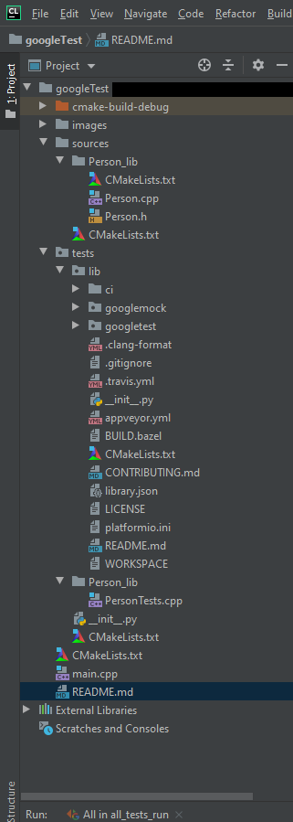
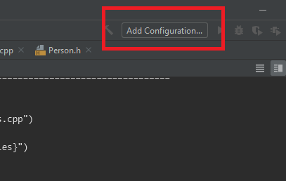
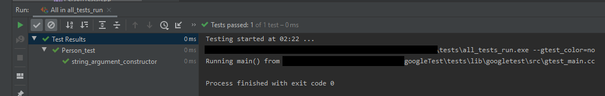

# How to setup CLION with Google test
## Project setup
1. create a clion project (default and everything, the one that gives you a main.cpp helloWorld)
2. create folders inside project named ```/Google_tests/lib``` and ```/sources```
3. create librairies inside ```/sources```, like ```/Person_lib``` in this example with the following structures
* CMakeLists.txt
* headers/cpp files, basically everything else

### Librairy cmake
The librairies ```CMakeLists.txt``` files contains:
```cmake
### modify _lib parameter
add_library(Person_lib ${CMAKE_CURRENT_LIST_FILE})
```
which scans all files inside and put it in a library named Person_lib.

**Note**: it is bad practice not to list manually all the files.

### Sources cmake
The ```CMakeLists.txt``` file inside ```/sources``` contains:
```cmake
# =============================================================
### MODIFY
set(LIBRARIES
        Person_lib)
# =============================================================

add_subdirectory(${LIBRARIES})
```

which you need to modify to add all librairies you create.

### Root cmake
This files build one executable: ***```app_run```*** given a ```main.cpp``` file outside of ```/sources```
```cmake
cmake_minimum_required(VERSION 3.15)
project(googleTest)

set(CMAKE_CXX_STANDARD 14)

# setup librairies and main.cpp executable
add_subdirectory(sources) # add all librairies
include_directories(sources) # headers?

add_executable(app_run main.cpp) # create executable

# =============================================================
### MODIFY
# executable uses those librairies
target_link_libraries(app_run
        Person_lib)
# =============================================================

# google tests
add_subdirectory(tests)
```
## Download google tests
1. big green button to download zip from [Google test official git repository](https://github.com/google/googletest)
2. extract contents into ```Google_tests/lib```, should look like:

## Test configuration
* Mirror your ```/sources``` structure file structure and add tests. Don't forget to include google tests and needed files:
```c++
#include <gtest/gtest.h>
#include <Person_lib/Person.h>
```
Create ```CMakeLists.txt``` inside ```/tests```, then:
* reference your test files so that the ```All_Tests``` variable knows about your tests.
* reference your source files such that ```All_Tests``` variable knows about your tests.
```cmake
include_directories(${gtest_SOURCE_DIR}/include ${gtest_SOURCE_DIR})

# declare relatives path to test files because
# relatives to projet
# =============================================================
### MODIFY
set(Person_lib_Tests_files
        "Person_lib/PersonTests.cpp")
set(All_Tests
        "${Person_lib_Tests_files}")

set(Sources
        "Person_lib/Person.cpp"
        "Person_lib/Person.h")
# =============================================================
list(TRANSFORM Sources PREPEND "../../sources/")

# test files to include
add_executable(all_tests_run
        ${All_Tests}
        ${Sources})

target_link_libraries(all_tests_run
        gtest
        gtest_main)
```
This will create ***```all_tests_run```***.

Now you have two executables. However ***```all_tests_run```*** is not the executable that has cute green 
checkmarks so we click in the upper right corner of the clion IDE, on "Add Configuration...":


(Optionnaly remove run_all_tests)
Click on the upper left + symbol > Google Test, change Target dropdown menu to ***```all_tests_run```*** > apply & ok

Now either your ***```app_run```*** or ***```all_tests_run```*** configuration and you should get:


which concludes our tutorial.